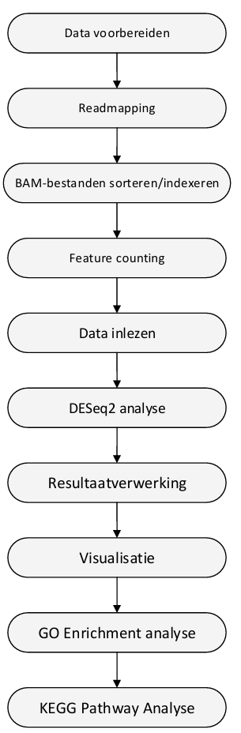

# Transcriptomics Casus – Reumatoïde Artritis (RA)

## 📁 Inhoud/structuur

- `data/` – Ruwe data bestanden/bewerkte data bestanden
- `scripts/` – Alle R-scripts (Rsubread, DESeq2, KEGG, GO)
- `bronnen/` - gebruikte bronnen 
- `README.md` - het document om de tekst hier te genereren
- `assets/` - Afbeeldingen die je in je README wilt tonen
- `data_stewardship/` - Voor de competentie beheren ga je aantonen dat je projectgegevens kunt beheren met behulp van GitHub. In deze folder kan je hulpvragen terugvinden om je op gang te helpen met de uitleg van data stewardship. 

## Introductie

Reumatoïde artritis (RA) is een systemische auto-immuunziekte die wordt gekenmerkt door chronische ontstekingen in de gewrichten, wat kan leiden tot gewrichtsschade, pijn en functieverlies (McInnes & Schett, 2011). Het ziekteproces wordt aangedreven door een complexe interactie van genetische, immunologische en omgevingsfactoren. Om meer inzicht te krijgen in de moleculaire mechanismen achter RA, is RNA-sequencing (RNA-seq) een waardevolle methode.

RNA-sequencing is een krachtige techniek waarmee de genexpressie in cellen op grote schaal kan worden geanalyseerd (Wang et al., 2009). Door RNA-seq data van RA-patiënten te vergelijken met die van gezonde controlepersonen, kunnen genen worden geïdentificeerd die significant anders tot expressie komen. Dit helpt bij het ontdekken van mogelijke biomarkers en geeft inzicht in de biologische processen die betrokken zijn bij RA (Guo et al., 2018).

In dit project wordt gebruik gemaakt van publiek beschikbare RNA-seq data van vier RA-patiënten en vier gezonde controles. Door deze data te analyseren en te visualiseren, wordt getracht inzicht te krijgen in welke genen betrokken zijn bij de pathogenese van RA en welke biologische processen hierbij mogelijk verstoord zijn.

Het doel van dit project is om differentieel tot expressie komende genen te identificeren tussen RA-patiënten en gezonde controlepersonen. Daarnaast wordt onderzocht welke biologische processen, GO-termen en KEGG-pathways verrijkt zijn bij RA.

## Methode 

In dit project is RNA-sequencing data van vier reumatoïde artritis (RA) patiënten en vier gezonde controles geanalyseerd. Eerst is de werkdirectory ingesteld en zijn de FASTQ-bestanden uitgepakt. Vervolgens zijn de reads gemapt op een [referentiegenoom](), dat vooraf is geïndexeerd met behulp van `buildindex()`. De gemapte reads zijn opgeslagen als BAM-bestanden, die gesorteerd en geïndexeerd zijn voor verdere verwerking.

Met `featureCounts()` zijn de reads per gen geteld en is een count matrix gegenereerd. Deze matrix is ingelezen in R voor differentiële expressie-analyse met `DESeq2`. Een behandelgroep (RA of controle) is toegevoegd, waarna de data is gecontroleerd op gehele waarden. De DESeq2-analyse is uitgevoerd om genen te identificeren die significant verschillend tot expressie komen. De resultaten zijn opgeslagen als CSV-bestand.

Vervolgens is het aantal significante genen bepaald en zijn de genen gesorteerd op log-fold-change en p-waarde. Ter visualisatie is een volcano plot gemaakt en opgeslagen als PNG-bestand. Daarna is een GO-enrichmentanalyse uitgevoerd met genlengtecorrectie via `nullp()` en verrijking via `goseq()`. De top 10 GO-termen zijn weergegeven in een bubble plot. Tot slot is een KEGG-pathwayanalyse uitgevoerd met pathview en zijn gen-pathway koppelingen onderzocht met `keggLink()`

Alle scripts zijn te vinden in de map `Scripts`, en gebruikte data en resultaten zijn beschikbaar in de map `Data`.

## 📊 Resultaten

De analyse resulteerde in een lijst van differentieel tot expressie komende genen. In totaal werden 2085 genen significant opgereguleerd en 2487 genen significant neerwaarts gereguleerd bij RA-patiënten ten opzichte van de controles. 

De genen met de hoogste fold change en de laagste p-waarden zijn geselecteerd voor nadere analyse. Visualisatie met een volcano plot [Figuur 1](assets/Volcanoplot.png). toont een duidelijke scheiding tussen up- en down-gereguleerde genen.

Daarnaast werden met behulp van GO-enrichment analyse meerdere biologisch relevante processen geïdentificeerd. De top GO-termen hadden voornamelijk betrekking op immuunresponsen, inflammatoire processen en celadhesie [Figuur 2](assets/Top_10_verrijkte_GO-termen.png).

Met KEGG pathway-analyse werden pathways zoals het Toll-like receptor signaling pathway (hsa04620) significant geassocieerd met de differentieel tot expressie komende genen [Figuur 3](assets/hsa04620_Toll-like_receptor_signaling_pathway.png).

De gebruikte plots en resultatenbestanden zijn beschikbaar in de map `Assets` en `Data`.

## Conclusie

Uit de analyse blijkt dat er significante verschillen zijn in genexpressie tussen RA-patiënten en gezonde controles. Vooral genen die betrokken zijn bij immuunrespons en ontstekingsprocessen tonen een verhoogde expressie bij RA-patiënten. 

De identificatie van relevante pathways, zoals het Toll-like receptor signaling pathway, bevestigt eerdere bevindingen over het belang van dit pad bij auto-immuunziekten. De verrijkte GO-termen ondersteunen de betrokkenheid van immuunprocessen in RA.

Deze resultaten dragen bij aan een beter begrip van de moleculaire mechanismen van RA en kunnen mogelijk in de toekomst bijdragen aan het ontwikkelen van biomarkers of nieuwe therapieën.

Voor vervolgonderzoek wordt aanbevolen om de dataset uit te breiden en validatie-experimenten uit te voeren op proteïneniveau om de biologische relevantie verder te onderbouwen.

